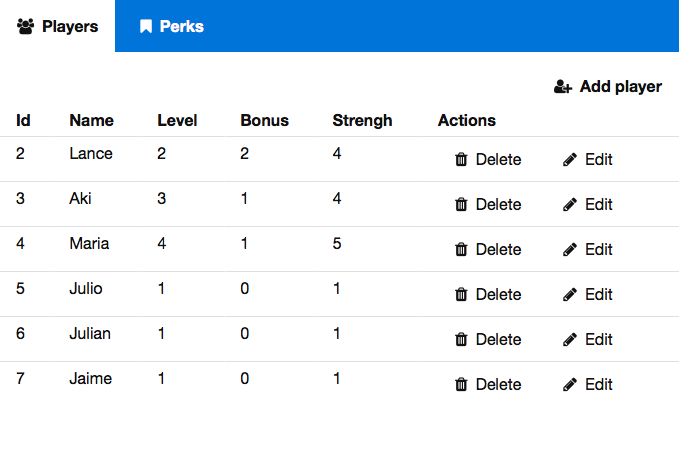
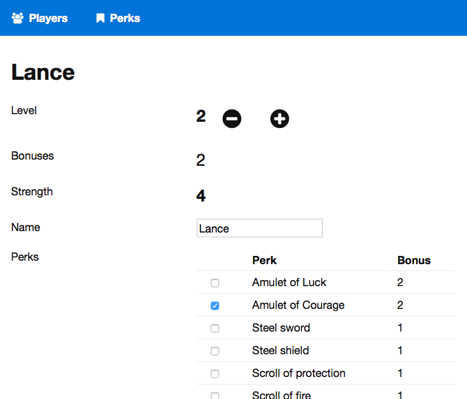
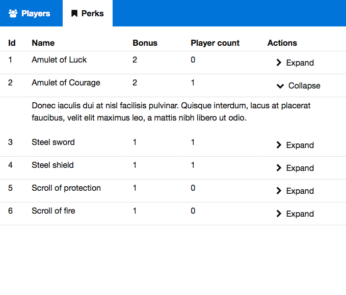

# An example SPA in Elm

An example Elm single page application built for http://www.elm-tutorial.org/

## This application uses

- [StartApp](https://github.com/evancz/start-app) for structure
- [Hop](https://github.com/sporto/hop) for routing
- [Webpack](https://webpack.github.io/) for building
- [Basscss](http://www.basscss.com/) for css styles
- [JsonServer](https://github.com/typicode/json-server) for fake api

## This application demonstrates

- Elm architecture
- Routing
- Ajax requests and Json parsing
- External CSS
- Ports to talk to JS

## Setup

- [Install Elm](http://elm-lang.org/install)
- [Install Node](https://nodejs.org/en/download/)

Install the necessary node packages:

```
npm install
```

## Running the application:

In one terminal run the webpack dev server:

```
npm run dev
```

In another terminal run the fake api server:

```
npm run api
```

Open http://localhost:3000

## Screenshots








## TODO

- Show Message should use the mailbox way
- Remove GetDeleteConfirmation from Main update, channel through player actions
- Remove three tuple returns from Players update
- Remove three tuple returns from Perks update
- Remove three tuple returns from PerksPlayers update

- Validation for player name when empty
- Search box for perks
- Tests
- When deleting a player delete associated perksPlayers


